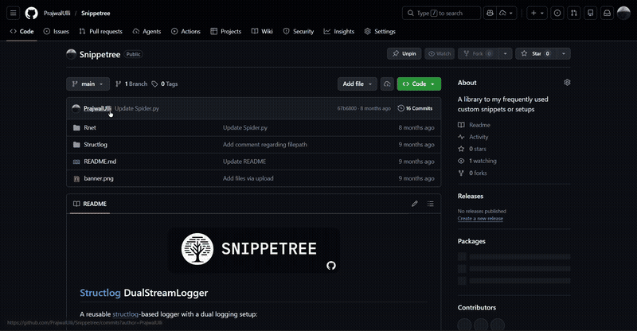
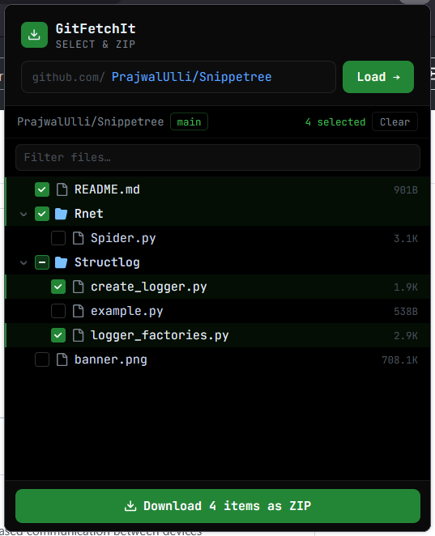
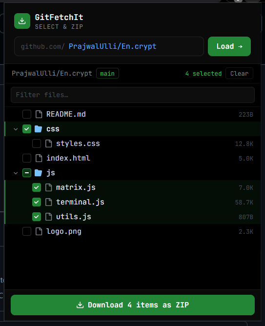

# GitFetchIt

**GitFetchIt** is a browser extension that lets you download specific files or folders from GitHub repositories — without cloning the entire repo.

> Downloads only work only on public repos 

<br>

## Demo



<br>

## Features

- 📦 Download **single or multiple files**
- 🗂️ Select and download **entire folders**
- ⚡ One-click download as a **ZIP file**
- 🧭 **Popup UI** to access and download without opening the repo page
- 🔢 Limits for stability:
  - Max selection: **10 items**
  - Max files per download: **10,000**
- 🌐 Works directly on **github.com**

<br>

## Screenshots

| Firefox | Chrome |
|--------|--------|
|  |  |

<br>

## Compatibility

- **Chrome** (Manifest V3)
- **Firefox** (Manifest V2)

<br>

## Build

Install dependencies:

```bash
npm install
```

Build for Chrome:
```bash
npm run build
```

Build for firefox

```bash
npm run build:firefox
```

Checkout the `.output` folder for the extension builds

<br>

## Don't Wanna Build
Just download the `output` folder from the repo, and follow below given steps.

<br>

## Installation

### Chrome

1. Clone or download this repository
2. Go to `chrome://extensions/`
3. Enable **Developer mode**
4. Click **Load unpacked**
5. Select the extension folder

### Firefox

1. Clone or download this repository
2. Open `about:debugging#/runtime/this-firefox`
3. Click **Load Temporary Add-on**
4. Select the `manifest.json` file or the zip thats generated in `.output` folder

<br>

## Usage

1. Open any repository on GitHub
2. Select files or folders using the extension UI
3. Click **Download**
4. Get a ZIP file instantly 🎉
5. Or use the Popup UI by clicking the extension icon.

<br>

## Limitations

- Only supports **github.com**
- Max selection: **10 items**
- Max files per download: **10,000**

<br>

## Inspiration

- https://github.com/git-download-manager/gitd-extension

<br>

## Acknowledgements

Built as a vibecoded project with help from Claude.

<br>

## Contributing

Contributions are welcome!  
Feel free to open issues or submit pull requests.

---

## Licence

See LICENSE for more details.
